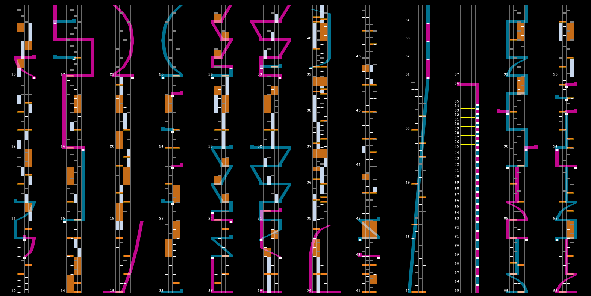

# kshoot-tools

NOTE: this tool is work in progress.

This is a collection of tools related to KSH and KSON chart files of K-Shoot Mania. This tool is created with [kshoot.js](https://github.com/123jimin/kshoot.js).

## Features

- Chart stat
- Chart renderer
- Radar renderer

## How to use

### Installation

Download [npm](https://docs.npmjs.com/downloading-and-installing-node-js-and-npm) first, then install `kshoot-tools` by executing the following command in a terminal.

```text
npm i -g 123jimin/kshoot-tools
```

### Basic usage

Example 1:

```text
kshoot test/chart.ksh
```

```text
1 chart from "test/"
- [Chart "Astar" (MXM 19) from "chart.ksh"]
```

Example 2:

```text
kshoot test/chart.ksh --stat
```

```text
1 chart from "test/"
- [Chart "Astar" (MXM 19) from "chart.ksh"]

== Stats ==
[Chart "Astar" (MXM 19) from "chart.ksh"]
- Duration: 122.500 s
- BPM: 96-448 (median: 192)
- notes: 1104 (991 chips + 113 holds)
- max density: 64
- lasers: 225 (76 moving lasers + 149 slams)
- one hand: 371
- hand trip: 288
- jacks: 21 (BC: 9, ADLR: 12)
- sofulan: 1184.0 (8 BPM changes)
```

### Chart rendering

```text
kshoot test/chart.ksh render -m=10 -c=12 -o="."
```

The command above creates `chart.ksh.png`, which looks like this:



## Planned tools

- [ ] Converter (KSH <-> KSON)
- [x] Renderer
- [x] Chart radar image rendering
- [ ] Linter
- [ ] Sync fix
- [ ] Curved laser generator
